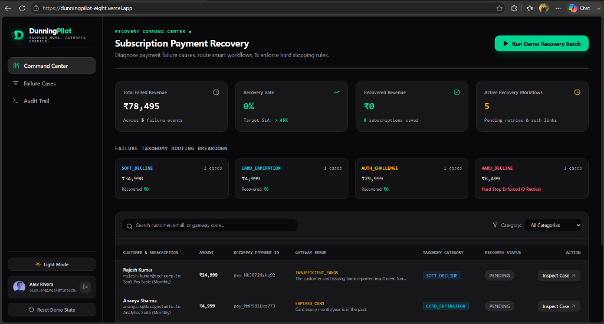
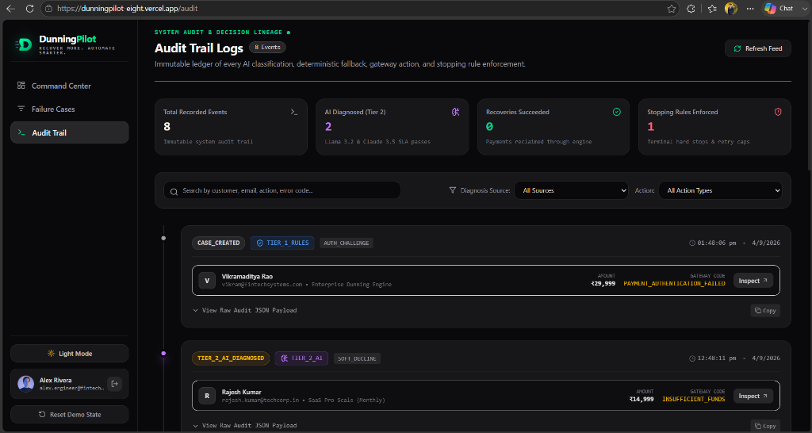

# 🚀 DunningPilot

> **Autonomous AI-Powered Subscription Payment Recovery & Intelligent Dunning Orchestration Platform**

[](https://nextjs.org/)
[](https://www.typescriptlang.org/)
[](https://tailwindcss.com/)
[](https://supabase.com/)
[](https://build.nvidia.com/)
[](https://dunningpilot-eight.vercel.app)

---

## 📌 Problem Statement

Involuntary churn accounts for **20% to 40% of all SaaS revenue losses**. When recurring subscription charges fail due to expired cards, temporary banking glitches, authorization challenges, or insufficient funds:

- **Dumb Retries Harm Merchants**: Naive cron jobs blindly retry failed payments at fixed intervals, triggering fraud alerts from issuing banks, risking merchant account suspension, and racking up penalty fees.
- **Generic Customer Outreach**: Impersonal, robotic emails go straight to spam or confuse customers, causing unnecessary drop-offs.
- **Lack of Diagnostic Intelligence**: Payment gateway error codes (e.g., `BAD_REQUEST_ERROR`, `GATEWAY_ERROR`) are obscure and offer no immediate context on whether a retry is safe or useless.
- **Zero Real-Time Auditing**: Engineering and finance teams have no single pane of glass to observe failure lifecycles, recovery rates, and decision reasoning in real time.

---

## 💡 Solution

**DunningPilot** transforms passive payment failure logging into an active, intelligent recovery copilot. It combines a high-speed deterministic rule engine with advanced LLM reasoning to maximize recovered Monthly Recurring Revenue (MRR) while protecting merchant standing.

### Key Capabilities:
- ⚡ **2-Tier Hybrid Diagnosis Engine**:
  - **Tier 1 (Deterministic Rules)**: Zero-latency instantaneous classification of common error patterns (Hard Declines, Expired Cards, 3DS Auth Challenges).
  - **Tier 2 (AI Reasoning with NVIDIA / Anthropic Claude)**: LLM analysis for ambiguous edge cases within strict 2.5s SLA timeouts to generate customized, context-aware recovery playbooks.
- 🛡️ **Smart Stopping Rules & Merchant Protection**: Automatically suspends retries on terminal hard declines, stolen cards, or when max retries are reached.
- 🎯 **Automated Multi-Channel Outreach Copy**: Dynamically crafts tailored email and SMS recovery messages with one-click payment update links.
- 📊 **Real-Time Command Center & Audit Trail**: Full visibility into active failure pipelines, recovered revenue metrics, retry logs, and step-by-step diagnostic reasoning.

---

## 🖼️ Screenshots

### 1. Command Center & Real-Time Recovery Dashboard
> *Monitor active failure pipelines, real-time recovery metrics (Total Failed Revenue, Recovery Rate, Recovered Revenue, Active Recovery Workflows), failure taxonomy breakdowns, and batch diagnostic runs.*



---

### 2. AI Diagnostic Playbook & Audit Trail Logs
> *Immutable ledger of every AI classification, deterministic fallback, gateway action, and stopping rule enforcement with raw JSON audit lineage.*



---

## 🛠️ Tech & Tools

### **Frontend & UI**
- **Framework**: [Next.js 15](https://nextjs.org/) (App Router, Server & Client Components)
- **Language**: [TypeScript](https://www.typescriptlang.org/)
- **Styling**: [Tailwind CSS v4](https://tailwindcss.com/)
- **Animations & Icons**: [Framer Motion](https://www.framer.com/motion/), [Lucide React](https://lucide.dev/)

### **Backend & Intelligence**
- **AI Models**: [NVIDIA NIM](https://build.nvidia.com/) (`meta/llama-3.2-11b-vision-instruct`) & [Anthropic Claude 3.5 Sonnet](https://www.anthropic.com/)
- **Database & Auth**: [Supabase](https://supabase.com/) (PostgreSQL with Row Level Security & Indexes)
- **Payment Gateway**: [Razorpay API & Subscriptions Engine](https://razorpay.com/)

---

## 🚀 How to Run and Install This Project

### 1. Prerequisites
Ensure you have the following installed on your machine:
- **Node.js**: `v18.18.0` or higher (Node.js 20+ recommended)
- **npm** / **pnpm** / **yarn**
- **Git**
- A free **[Supabase](https://supabase.com)** account
- An **[NVIDIA API Key](https://build.nvidia.com)** or **[Anthropic API Key](https://console.anthropic.com/)**
- A **[Razorpay](https://dashboard.razorpay.com/)** test key (optional for full gateway integration)

---

### 2. Clone the Repository
```bash
git clone https://github.com/sachin0610-srm/dunningpilot.git
cd dunningpilot
```

---

### 3. Install Dependencies
```bash
npm install
```

---

### 4. Environment Variables Setup
Create a `.env.local` file in the root directory by copying `.env.example`:

```bash
cp .env.example .env.local
```

Open `.env.local` and configure your credentials:

```env
# Supabase Credentials
NEXT_PUBLIC_SUPABASE_URL=https://your-project.supabase.co
NEXT_PUBLIC_SUPABASE_PUBLISHABLE_KEY=your_supabase_publishable_key
NEXT_PUBLIC_SUPABASE_ANON_KEY=your_supabase_anon_key
SUPABASE_SERVICE_ROLE_KEY=your_supabase_service_role_key

# AI Diagnosis Engine (NVIDIA NIM or Anthropic)
NVIDIA_API_KEY=nvapi-your-key-here
NVIDIA_MODEL=meta/llama-3.2-11b-vision-instruct

# Optional: Anthropic Claude Fallback
ANTHROPIC_API_KEY=sk-ant-your-key-here

# Razorpay Credentials (Test Mode)
RAZORPAY_KEY_ID=rzp_test_your_key_id
RAZORPAY_KEY_SECRET=your_razorpay_secret
```

---

### 5. Setup Supabase Database
Run the migration scripts in your Supabase SQL Editor:
1. Copy and run `supabase/migrations/01_schema.sql` to initialize tables and indexes (`subscriptions`, `failure_events`, `recovery_attempts`, `audit_log`).
2. Copy and run `supabase/migrations/02_seed.sql` to populate sample subscriptions and failure scenarios.

---

### 6. Run the Development Server
```bash
npm run dev
```

Open your browser and navigate to:
```
http://localhost:3000
```

---

### 7. Exploring Features
- **Run Demo Batch**: Click **"Run Demo Batch"** on the dashboard header to trigger the diagnosis engine across all pending failure cases.
- **Inspect Cases**: Click any row in the failures table to view the AI diagnosis, playbook, and suggested customer communication.
- **Audit Log**: Navigate to `/audit` to see an immutable timeline of every classification and recovery attempt.
- **Reset State**: Click **"Reset Demo State"** anytime to refresh test data back to initial seed values.

---

## 👨‍💻 Author

**Sachin**
- **GitHub**: [@sachin0610-srm](https://github.com/sachin0610-srm)
- **Email**: [sachinlava14@gmail.com](mailto:sachinlava14@gmail.com)
- **Repository**: [https://github.com/sachin0610-srm/dunningpilot](https://github.com/sachin0610-srm/dunningpilot)

---

<p align="center">
  Built with ❤️ for intelligent SaaS subscription recovery.
</p>
